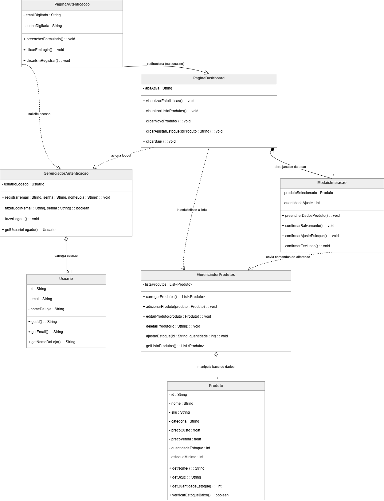
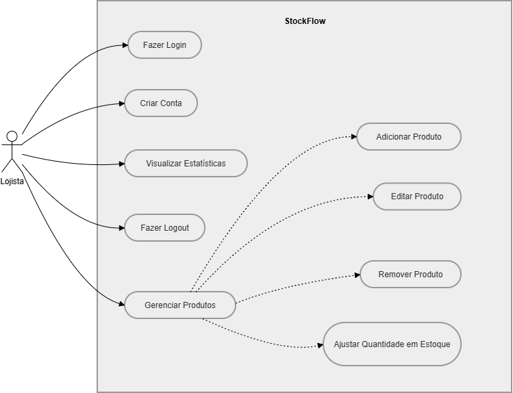

# StockFlow

Sistema desenvolvido para o gerenciamento e controle de estoque de múltiplas lojas, permitindo melhor organização, monitoramento de produtos e eficiência operacional.

## Diagrama de Classes

## Diagrama de casos de uso

